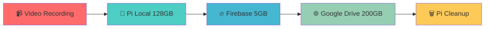

# 🐟 Fish Feeder Smart Hybrid Storage System

<div align="center">


**🎯 ระบบให้อาหารปลาอัตโนมัติ พร้อม Video Recording และ Smart Cloud Storage**

[🚀 Quick Start](#-quick-start) • [📖 Documentation](#-documentation) • [🌐 Demo](#-demo-urls) • [🔧 API](#-api-reference)

</div>

---

## 🌟 Features Highlights

<table>
<tr>
<td width="50%">

### 🎬 **Smart Video Recording**
- 📹 Auto-record ขณะให้อาหาร
- 🎥 MP4 format พร้อม timestamp
- 📱 Mobile-friendly playback
- 🔄 Real-time streaming

</td>
<td width="50%">

### ☁️ **Hybrid Cloud Storage**
- 💾 Pi Local: 128GB
- 🔥 Firebase: 5GB (instant)
- 🌐 Google Drive: 200GB
- **รวม: 333GB!**

</td>
</tr>
<tr>
<td>

### 🚀 **One-Click Deploy**
- 🤖 Auto-setup ทุกอย่าง
- ⚙️ Systemd service
- 🔧 Dependencies auto-install
- ✅ Ready in minutes!

</td>
<td>

### 🌍 **External Access**
- 🔗 PageKite tunnel
- 📱 Mobile web app
- 🔒 Secure connections
- 🌏 Access anywhere

</td>
</tr>
</table>

---

## 🚀 Quick Start

### ⚡ One-Click Deployment (แนะนำ)

```bash
# Clone repository
git clone <repository-url>
cd pi-mqtt-server

# Deploy to Pi ในคำสั่งเดียว!
python3 deployment/one_click_deploy.py
```

### 🎯 Manual Setup

```bash
# Deploy files to Pi
./deployment/deploy_to_pi.sh

# SSH to Pi and setup
ssh pi@raspberrypi.local
cd /home/pi/pi-mqtt-server
./auto_setup_pi.sh

# Setup Google Drive OAuth
python3 scripts/google_drive_setup.py

# Start system
python3 main.py
```

---

## 📁 Project Structure

```
pi-mqtt-server/
├── 📄 main.py                    # Core application
├── 🔧 smart_hybrid_storage.py    # Storage management system
├── 📊 VERSION                    # Current version
├── 📋 .gitignore                 # Git ignore rules
├── 🔐 serviceAccountKey.json     # Firebase credentials
│
├── 📂 config/                    # Configuration files
│   ├── storage_config.json       # Storage settings
│   ├── google_drive_credentials.json
│   ├── requirements.txt          # Basic dependencies
│   └── requirements_enhanced.txt # Full dependencies
│
├── 📂 deployment/                # Deployment scripts
│   ├── one_click_deploy.py       # 🚀 Auto deployment
│   └── deploy_to_pi.sh          # Manual deployment
│
├── 📂 scripts/                   # Utility scripts
│   ├── setup_hybrid_storage.py  # Storage setup
│   ├── google_drive_setup.py    # Google Drive OAuth
│   ├── test_google_drive.py     # Test credentials
│   ├── integrate_hybrid_storage.py
│   ├── main_integration.py
│   ├── start_pagekite.sh        # Start tunnel
│   ├── stop_pagekite.sh         # Stop tunnel
│   ├── status_pagekite.sh       # Check status
│   └── pagekite_setup.py        # PageKite config
│
├── 📂 docs/                      # Documentation
│   ├── README_HYBRID_STORAGE.md # Storage system docs
│   ├── DEPLOY_INSTRUCTIONS.md   # Setup instructions
│   ├── SETUP_COMPLETE.md        # Complete setup guide
│   ├── QUICK_SETUP.md           # Quick reference
│   └── CHANGELOG.md             # Version history
│
├── 📂 storage/                   # Data directory (created on Pi)
├── 📂 logs/                      # Log files
└── 📂 .git/                      # Git repository
```

---

## 💾 Smart Storage System

### 🔄 Auto Migration Flow



### 📊 Storage Capacity

| Storage Tier | Capacity | Purpose | Auto-cleanup |
|-------------|----------|---------|--------------|
| **Pi Local** | 128GB | Live recording, recent files | 7 days |
| **Firebase** | 5GB | Immediate cloud backup | 24 hours → Google Drive |
| **Google Drive** | 200GB | Long-term archive | Manual |
| **Total Effective** | **333GB** | Smart hybrid system | Automatic |

---

## 🌐 Demo URLs

| Service | URL | Purpose |
|---------|-----|---------|
| 🖥️ **Main Web App** | https://fish-feeder-test-1.web.app | Primary control panel |
| 🌍 **External Access** | https://b65iee02.pagekite.me | PageKite tunnel |
| 🏠 **Local Access** | http://localhost:5000 | Direct Pi access |

---

## 🔧 API Reference

### 🎬 Video Recording
```bash
# Start recording
POST /api/camera/record/start
{"duration": 30, "quality": "high"}

# Stop recording  
POST /api/camera/record/stop

# Get recording status
GET /api/camera/record/status
```

### 🌐 PageKite Control
```bash
# Start tunnel
POST /api/pagekite/start

# Stop tunnel
POST /api/pagekite/stop

# Check status
GET /api/pagekite/status
```

### 💾 Storage Management
```bash
# Get storage info
GET /api/storage/status

# Force migration
POST /api/storage/migrate
{"source": "local", "target": "google_drive"}

# Cleanup old files
POST /api/storage/cleanup
{"days": 7}
```

### 🐟 Fish Feeding
```bash
# Feed fish (with video)
POST /api/feed
{"amount": 1, "record_video": true}

# Get feeding history
GET /api/feeding/history

# Get last feeding
GET /api/feeding/last
```

---

## ⚙️ System Requirements

### 🔧 Hardware
- **Raspberry Pi 4** (recommended) or Pi 3B+
- **Camera Module** (Pi Camera or USB webcam)
- **SD Card** 32GB+ (OS) + 128GB+ USB drive (storage)
- **Internet Connection** (WiFi or Ethernet)

### 💻 Software
- **Raspberry Pi OS** (latest)
- **Python 3.7+**
- **Git**
- **SSH enabled**

### 🌐 Cloud Services
- **Firebase Project** (free tier: 5GB)
- **Google Drive API** (200GB+ recommended)
- **PageKite Account** (free tier available)

---

## 🛠️ Development

### 🔄 Local Development
```bash
# Install dependencies
pip3 install -r config/requirements_enhanced.txt

# Run development server
python3 main.py

# Run tests
python3 scripts/test_google_drive.py
```

### 🧪 Testing
```bash
# Test storage system
python3 -c "
from smart_hybrid_storage import SmartHybridStorage
storage = SmartHybridStorage()
print(storage.get_storage_status())
"

# Test PageKite
./scripts/status_pagekite.sh

# Test camera
raspistill -o test.jpg
```

---

## 📋 Configuration

### 🔧 Storage Config (`config/storage_config.json`)
```json
{
  "pi_local": {
    "path": "/home/pi/fish_feeder_data",
    "max_size_gb": 128,
    "cleanup_days": 7
  },
  "firebase": {
    "max_size_gb": 5,
    "bucket": "fish-feeder-test-1.appspot.com"
  },
  "google_drive": {
    "max_size_gb": 200,
    "folder_name": "FishFeeder_Videos"
  },
  "pagekite": {
    "subdomain": "b65iee02.pagekite.me",
    "local_port": 5000
  }
}
```

### 🔐 Environment Variables
```bash
export GOOGLE_APPLICATION_CREDENTIALS="config/google_drive_credentials.json"
export FIREBASE_SERVICE_ACCOUNT="serviceAccountKey.json"
export PAGEKITE_SUBDOMAIN="b65iee02.pagekite.me"
```

---

## 🚨 Troubleshooting

<details>
<summary>📦 <strong>Deployment Issues</strong></summary>

```bash
# Check Pi connection
ping raspberrypi.local

# Test SSH
ssh pi@raspberrypi.local

# Re-deploy
python3 deployment/one_click_deploy.py
```
</details>

<details>
<summary>☁️ <strong>Storage Issues</strong></summary>

```bash
# Check storage status
python3 -c "
from smart_hybrid_storage import SmartHybridStorage
storage = SmartHybridStorage()
print(storage.get_storage_status())
"

# Test Google Drive
python3 scripts/test_google_drive.py

# Re-setup OAuth
python3 scripts/google_drive_setup.py
```
</details>

<details>
<summary>🌐 <strong>PageKite Issues</strong></summary>

```bash
# Check status
./scripts/status_pagekite.sh

# Restart tunnel
./scripts/stop_pagekite.sh
./scripts/start_pagekite.sh

# Re-configure
python3 scripts/pagekite_setup.py
```
</details>

<details>
<summary>🎬 <strong>Video Recording Issues</strong></summary>

```bash
# Test camera
raspistill -o test.jpg

# Check permissions
ls -la /home/pi/fish_feeder_data/

# Fix permissions
sudo chown -R pi:pi /home/pi/fish_feeder_data/
```
</details>

---

## 📜 License

MIT License - feel free to use and modify!

---

## 🤝 Contributing

1. Fork the project
2. Create feature branch (`git checkout -b feature/amazing-feature`)
3. Commit changes (`git commit -m 'Add amazing feature'`)
4. Push to branch (`git push origin feature/amazing-feature`)
5. Open Pull Request

---

## 📞 Support

- 📖 **Documentation**: Check `docs/` folder
- 🐛 **Issues**: Open GitHub issue
- 💬 **Discussions**: GitHub discussions
- 📧 **Contact**: [Your email]

---

<div align="center">

**🎉 Made with ❤️ for Smart Fish Feeding**

⭐ **Star this repo if it helped you!** ⭐

</div>
